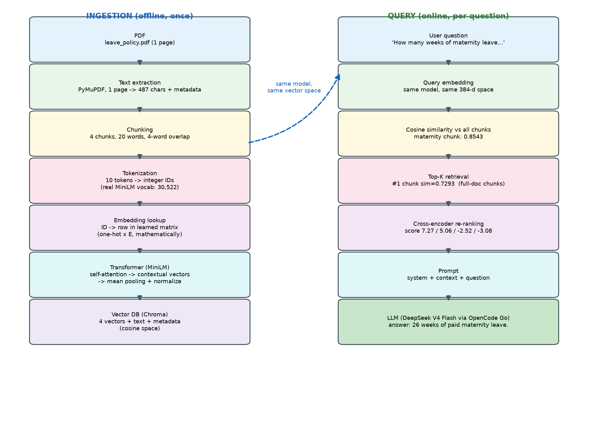
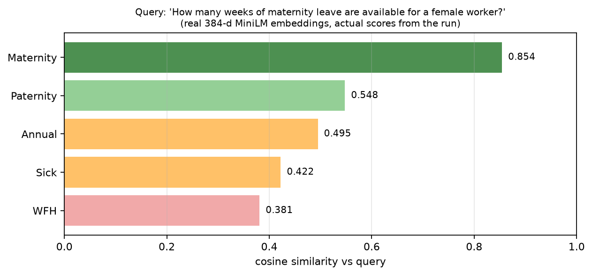
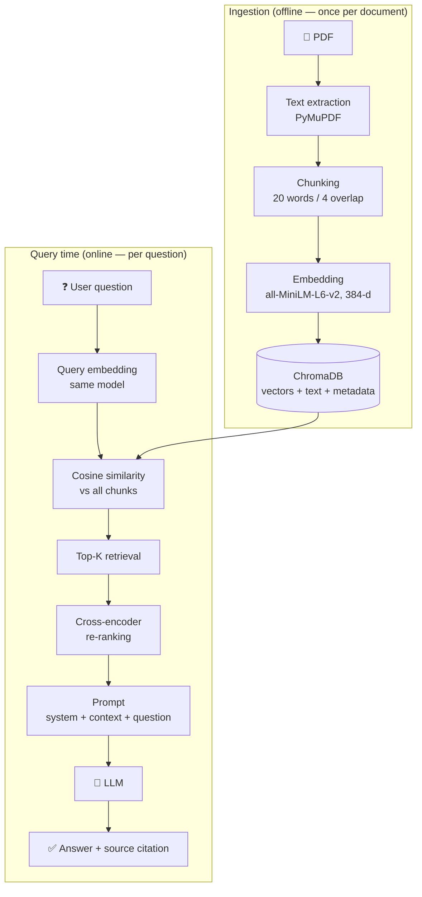

# Mini RAG Learning Lab

A Retrieval-Augmented Generation (RAG) pipeline built from scratch in a single Colab notebook — no LangChain, no hidden abstractions. Every intermediate value in the pipeline is printed: tokens, token IDs, embedding vectors, similarity scores, re-ranking scores, the exact prompt, and the final grounded answer.

I built this to understand RAG deeply for ML interviews — not to ship a production system. The whole pipeline runs on a free Colab CPU instance in about 5–10 minutes, including model downloads.



## What the pipeline does

Given a small company leave policy PDF, the system answers natural-language questions about it:

```
Question: How many weeks of maternity leave are available for a female worker?
Answer:   26 weeks of paid maternity leave.
Source:   leave_policy.pdf — page 1
```

That answer was generated by a real LLM (DeepSeek V4 Flash via OpenCode Go), grounded in context retrieved from the vector DB — not from the model's memory.

## The full journey of one sentence

The core of the notebook follows one sentence through every stage, with the actual outputs from the run:

| Stage | What happens | Real output from the run |
|---|---|---|
| PDF | A 1-page leave policy, created programmatically | `leave_policy.pdf`, 1,163 bytes |
| Extraction | PyMuPDF pulls text + metadata | `{"text": "...", "metadata": {"source": "leave_policy.pdf", "page": 1}}` |
| Chunking | 20-word windows, 4-word overlap | 4 chunks (e.g. *"Female employees receive 26 weeks of paid maternity leave."*) |
| Tokenization | MiniLM's WordPiece tokenizer (vocab = 30,522) | `['female','employees','receive','26','weeks','of','paid','maternity','leave','.']` |
| Token IDs | Each token → its integer position in the vocabulary | `[2931, 5126, 4374, 2656, 3134, 1997, 3825, 23676, 2681, 1012]` |
| Embedding lookup | ID → row of the learned embedding matrix (one-hot × E is the math equivalent) | demonstrated with a toy 5×3 matrix |
| Transformer | 12 layers of self-attention make each token context-aware; hand-built attention math shown step by step | `softmax(QKᵀ/√d_k)·V` computed with real NumPy |
| Pooling | Mean over token vectors + L2 normalization | reproduced `model.encode()` by hand, max diff `1.49e-08` |
| Chunk embedding | One 384-d vector per chunk | `[0.0147, -0.0286, -0.0403, 0.0531, 0.0447, 0.0860, -0.0824, ...]`, norm = 1.0 |
| Vector DB | ChromaDB stores vectors + text + metadata (cosine space) | 4 vectors in collection `leave_policy` |
| Query embedding | Same model embeds the question into the same space | 384-d vector |
| Retrieval | Cosine similarity against every chunk | maternity chunk scores **0.8543** (see chart below) |
| Re-ranking | Cross-encoder reads query + chunk together | scores `[7.27, 5.06, -2.52, -3.08]` |
| Prompt | Built by hand: system + context + question | 766 chars, ~173 tokens |
| Generation | LLM answers from context only | *"26 weeks of paid maternity leave."* |



## Architecture



The two phases are kept strictly separate in the notebook: ingestion runs once, query time runs per question.

## Stack

- **PDF:** PyMuPDF — the PDF is generated inside the notebook, so the project is fully self-contained
- **Embeddings:** `sentence-transformers/all-MiniLM-L6-v2` (384-d, 30,522-token vocab, mean pooling)
- **Vector DB:** ChromaDB (persistent, cosine space)
- **Re-ranking:** `cross-encoder/ms-marco-MiniLM-L-6-v2`
- **LLM:** DeepSeek V4 Flash via OpenCode Go (any OpenAI-compatible provider works — OpenAI, Gemini, Groq, or a custom base URL; the notebook lists the models your key can access)
- **Math/visuals:** PyTorch (autograd demo of how embeddings are learned), NumPy, scikit-learn (PCA, cosine), Matplotlib, ipywidgets

## Why these choices

- **MiniLM over a bigger model** — 384 dimensions is enough for a small corpus, it runs on Colab's free CPU, and it downloads in seconds. The trade-off vs. e.g. 1024-d models is discussed in the notebook.
- **Cosine similarity + cross-encoder, not just one stage** — bi-encoder retrieval is fast but shallow (two independently-encoded vectors compared). The cross-encoder sees the query and chunk together and re-orders only the top candidates. The notebook shows the before/after scores.
- **Manual prompt, no LangChain** — the prompt is a plain formatted string. A mapping table at the end shows exactly what LangChain would abstract away.
- **The document is 5 paragraphs** — the point is to see every number, not to benchmark retrieval on a big corpus.

## What's in the notebook

25 sections, each with definition → intuition → math → code → real output → summary → interview question:

1. RAG overview
2. PDF text extraction
3. Chunking + overlap (with failure experiments)
4. Tokenization — what a token ID actually is
5. Token ID → embedding lookup (toy matrix + one-hot math)
6. How embedding values are learned (real PyTorch autograd gradient descent)
7. Real embedding model
8. Inside the embedding model
9. Self-attention mathematics (full hand calculation)
10. Pooling → chunk embedding (verified against `model.encode`)
11. Vector space + PCA plot
12. Query embedding
13. Cosine similarity (by hand, then real scores)
14. Vector database (ChromaDB)
15. Top-K retrieval
16. Cross-encoder re-ranking
17. Building the RAG prompt
18. Final LLM answer (real provider or labelled demo mode)
19. Visual pipeline dashboard
20. Interactive widgets
21. Six RAG failure experiments (bad chunks, no overlap, wrong retrieval, K too small/large, re-rank changes)
22. RAG vs fine-tuning
23. Full architecture + end-to-end `run_rag()` function
24. Code quality notes + LangChain mapping table
25. Interview checkpoints, cheat sheet, glossary

## Run it

1. Open the notebook in Colab:

   [](https://colab.research.google.com/github/AjmalDanish/mini-rag-learning-lab/blob/main/Mini_RAG_Learning_Lab.ipynb)

2. Run the cells top to bottom (the first cell installs everything).
3. In Section 18, pick a provider (OpenCode Go is the default), paste an API key when prompted, and choose a model. Press Enter with no key to see the labelled demo mode — the pipeline completes either way.

Expected runtime on a free Colab CPU: ~5–10 minutes, mostly model downloads (~90 MB each for MiniLM and the cross-encoder).

## Repository layout

```
mini-rag-learning-lab/
├── Mini_RAG_Learning_Lab.ipynb   # the whole project: 25 sections, all outputs included
├── README.md
├── requirements.txt              # exact dependencies (Colab preinstalls most of them)
├── docs/
│   └── Project_Explainer.pdf     # written explanation of every stage + interview Q&A
└── assets/
    ├── pipeline.png              # architecture diagram with real numbers
    └── cosine_scores.png         # real similarity scores from the run
```

## Interview notes

A short version of what this project lets me explain:

- **What is a token ID?** An integer index into the tokenizer's vocabulary — a lookup position, not a semantic value.
- **Where do embedding values come from?** They're learned parameters, updated by gradient descent (`E_new = E_old − lr·dL/dE`). The notebook runs this with real autograd gradients.
- **Why a vector DB?** It stores vectors + payloads and does fast nearest-neighbour search; it doesn't understand language — the embedding model creates all the meaning.
- **Why re-rank?** Bi-encoder retrieval is cheap recall over everything; the cross-encoder re-scores only the top candidates for precision.
- **How does RAG reduce hallucination?** Grounding: the LLM answers from supplied context with a "say you don't know" constraint, and the answer carries a source citation.

## License

MIT
