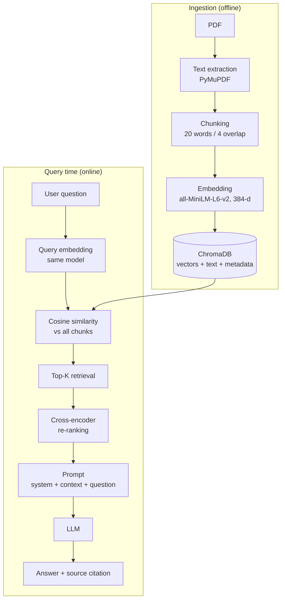

# Mini RAG Learning Lab

[](https://www.python.org/downloads/)
[](LICENSE)
[](tests/)

A complete RAG (Retrieval-Augmented Generation) pipeline built from scratch — **no LangChain, no hidden abstractions**. Every intermediate value is printed: tokens, token IDs, embedding vectors, similarity scores, re-ranking scores, the exact prompt, and the final grounded answer.


## Quick Start

```bash
# Clone the repo
git clone https://github.com/AjmalDanish/mini-rag-learning-lab.git
cd mini-rag-learning-lab

# Install dependencies
pip install -r requirements.txt

# Run the CLI demo
python main.py

# Or launch the dashboard
streamlit run app.py
```

## What It Does

Given a small company leave policy PDF, the system answers natural-language questions:

```
Question: How many weeks of maternity leave are available?
Answer:   26 weeks of paid maternity leave.
Source:   leave_policy.pdf — page 1
```

## Three Ways to Run

| Mode | Command | Best For |
|------|---------|----------|
| **Colab Notebook** | [](https://colab.research.google.com/github/AjmalDanish/mini-rag-learning-lab/blob/main/Mini_RAG_Learning_Lab.ipynb) | Learning — 25 sections with explanations |
| **CLI Demo** | `python main.py` | Quick test — see the pipeline in action |
| **Dashboard** | `streamlit run app.py` | Interactive — explore each stage visually |

## Architecture



## Project Structure

```
mini-rag-learning-lab/
├── main.py                       # CLI entry point
├── app.py                        # Streamlit dashboard
├── config.yaml                   # pipeline configuration
├── requirements.txt              # dependencies
│
├── src/                          # modular source code
│   ├── ingestion/loader.py       # PDF text extraction
│   ├── chunking/chunker.py       # text chunking strategies
│   ├── embeddings/embedder.py    # sentence-transformers wrapper
│   ├── vectordb/vector_store.py  # ChromaDB operations
│   ├── retrieval/retriever.py    # retrieval + cross-encoder re-ranking
│   ├── prompts/prompt_templates.py # RAG prompt building
│   ├── llm/llm_client.py         # OpenAI-compatible API client
│   └── utils/helpers.py          # utility functions
│
├── tests/test_core.py            # 23 unit tests
├── Mini_RAG_Learning_Lab.ipynb   # notebook (25 sections)
├── docs/Project_Explainer.pdf    # written explanation
└── assets/                       # diagrams and screenshots
```

## Stack

| Component | Technology | Why |
|-----------|-----------|-----|
| **PDF** | PyMuPDF | Fast, lightweight, generates PDFs programmatically |
| **Embeddings** | `all-MiniLM-L6-v2` (384-d) | Small enough for CPU, good quality |
| **Vector DB** | ChromaDB | Persistent, cosine space, simple API |
| **Re-ranking** | `ms-marco-MiniLM-L-6-v2` | Cross-encoder for precision |
| **LLM** | Any OpenAI-compatible API | OpenAI, Gemini, Groq, or custom endpoint |
| **Dashboard** | Streamlit + Plotly | Interactive visualization |

## Notebook Sections (25)

The notebook follows one sentence through the entire journey:

| # | Section | What You Learn |
|---|---------|----------------|
| 1 | RAG Overview | What RAG is and why it exists |
| 2 | PDF Extraction | PyMuPDF pulls text + metadata |
| 3 | Chunking | 20-word windows, 4-word overlap |
| 4 | Tokenization | WordPiece tokenizer (vocab = 30,522) |
| 5 | Embedding Lookup | Token ID → row of embedding matrix |
| 6 | Learning Embeddings | Real PyTorch autograd gradient descent |
| 7 | Real Embedding Model | Load `all-MiniLM-L6-v2` |
| 8 | Inside the Model | Transformer architecture |
| 9 | Self-Attention Math | Full hand calculation of `softmax(QKᵀ/√d_k)·V` |
| 10 | Pooling | Mean over token vectors + L2 normalization |
| 11 | Vector Space | PCA plot of embeddings |
| 12 | Query Embedding | Embed the user question |
| 13 | Cosine Similarity | By hand, then real scores |
| 14 | Vector Database | ChromaDB storage + retrieval |
| 15 | Top-K Retrieval | Get most similar chunks |
| 16 | Re-ranking | Cross-encoder re-scores candidates |
| 17 | Build Prompt | System + context + question |
| 18 | Final Answer | LLM generates grounded response |
| 19-25 | Extras | Dashboard, failure experiments, LangChain comparison, interview prep |

## Interview Notes

This project demonstrates understanding of:

- **Tokenization** — token IDs are integer indices, not semantic values
- **Embeddings** — learned parameters updated by gradient descent (`E_new = E_old − lr·dL/dE`)
- **Vector search** — fast nearest-neighbour with HNSW indexes
- **Two-stage retrieval** — bi-encoder recall + cross-encoder precision
- **RAG vs fine-tuning** — when to use each approach
- **Hallucination reduction** — grounding in retrieved context with source citations

## Running Tests

```bash
python -m pytest tests/ -v
```

23 tests covering: chunking, prompt building, PDF extraction, cosine similarity, one-hot equivalence, and notebook structure validation.

## License

MIT
